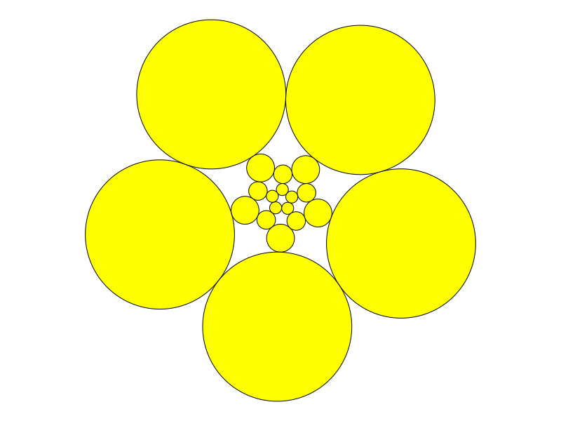
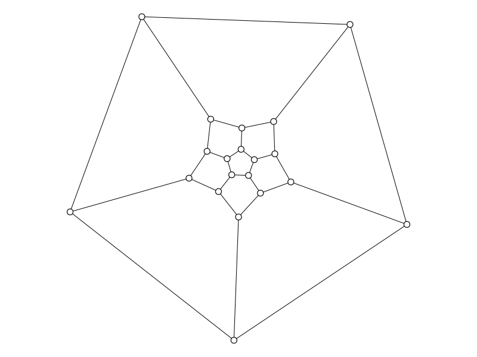

# Coin Representations of 3-Connected Planar Graphs

Let `G` be a three-connected planar graph. This module finds a 
mapping from the vertices of `G` to disks in the plane with the
property that adjacent vertices map to externally tangent disks and
nonadjacent vertices map to disjoint disks. The `examples` directory
contains demonstrations of this module. 

## Creating the representation

The function `CoinRepresentation` is used to find the disks. It is invoked 
as `CoinRepresentation(G,F)` where `G` is the graph and `F` contains the vertices
on the outside face of `G`. `F` may be given either as a list (i.e. a `Vector`)
or as a `Set`. It may also be omitted in which case a default face is used.
```
julia> using SimpleGraphs, CoinRepresentations, Clines

julia> G = Dodecahedron()
Dodecahedron (n=20, m=30)

julia> R = CoinRepresentation(G)
[ Info: Selecting {2,3,7,8,9} as outside face
CoinRepresentation of a graph with 20 vertices
```
The circles in `R` may be accessed using square brackets:
```
julia> R[1]
Circle(4.469190366384342, -5.691323826162915, 4.344748737824545)
```

The function `keys` can be used to iterate over the names of the circles
and `values` to iterate over the circles themselves.

## Visualization

The `draw` function draws a picture of the coin representation. The 
syntax is `draw(R, :color)` where `:color` is a valid name of a color
(as allowed by `Plots` and given as a `Symbol`) or the `:none` for
empty circles. The default if the color is omitted is `:yellow`.
```
julia> G = Dodecahedron()
Dodecahedron (n=20, m=30)

julia> R = CoinRepresentation(G)
[ Info: Selecting {2,3,7,8,9} as outside face
CoinRepresentation of a graph with 20 vertices

julia> draw(R)
```
produces this:



### Coin embedding
Coin representations can be used to provide a planar embedding of a graph
by placing each vertex at the center of its respective disk.

Use `center_embed(G::SimpleGraph, R::CoinRepresentation)` to give `G`
such an embedding.
```
julia> center_embed(G,R)

julia> draw(G)
```
gives this:



## Various poorly documented

### Direct functions

* `radii(G,F)` to calculate the radii of the graph's disk and its dual.
* `centers(G,r,rr)` to calculate the centers for graph's disks and its dual.

### Transformation

* If `f` is a `LinearFractionalTransformation`, we can apply `f` to 
a representation to get a new representation. 

### Validity of the graphs

This code does not check if the graph is planar or if its three-connected.
It is assumed the graph has a `RotationSystem` in place that specifies
the (abstract) planar embedding. 

If you know your graph is planar, but it does not have a rotation system
already, you can create one as follows. Let `F` be a list of the vertices in a face (in order). Then do this:
```
julia> embed(G,:tutte, outside=F)

julia> set_rot(G)
```
You can now check the rotation system is in place with `get_rot(G)`. 

You can then check if the graph is three-connected (requires `SimpleGraphAlgorithms`) and if the Euler characteristic is 2:
```
julia> connectivity(G)
3

julia> euler_char(G)
2
```
